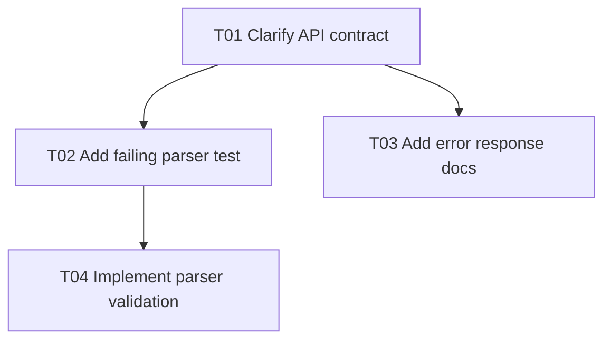

## Required Output Structure

Always output the plan with these sections in this order:

1. `Plan Summary`
2. `Execution Waves`
3. `Task List`
4. `Checkpoints`
5. `Trackable Todo List`
6. `Task Graph`

## Plan Summary

Summarize the plan in one concise line.

## Execution Waves

Summarize the rollout order before listing individual tasks.

Recommended shape:

```text
W1 (T01): establish the shared contract | sequential
W2 (T02, T03): implement backend and frontend slices against the stable contract | parallel after W1
```

## Task List

Render each task using this shape:

```text
T01. <Title>
- Type: coding | infra | config | data | doc | design | research | review | release | other
- Wave: W1 | W2 | W3
- Execution: parallel | sequential
- Depends-on: none | Txx[, Tyy]
- Objective: <single concrete outcome>
- Steps:
  1. ...
  2. ...
  3. ...
- Verification: <command, suite, review signal, or observable behavior>
```

Keep steps lightweight and outcome-focused.

Use `Type` for the task's broad category, not for detailed subsystem naming.

## Checkpoints

List checkpoints separately so they are easy to scan during execution.

Recommended shape:

```text
C1. After T02, confirm <fact>
C2. After T04 and T05, confirm <fact>
```

## Trackable Todo List

Provide a trackable to-do list using one line per task:

```text
1. <short title> — not-started
2. <short title> — not-started
3. <short title> — not-started
```

Keep the numbering stable so the list can be tracked later in another tool or workflow.

## Task Graph

Use Mermaid.

Requirements:

- every task in `Task List` must appear exactly once in the graph
- edges must reflect `depends-on`
- wave ordering must agree with the graph layering
- keep labels short and stable
- do not invent graph-only nodes

Example:


